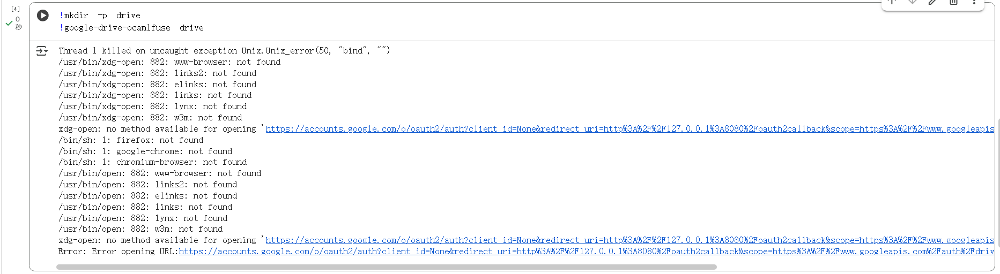
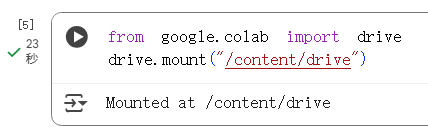
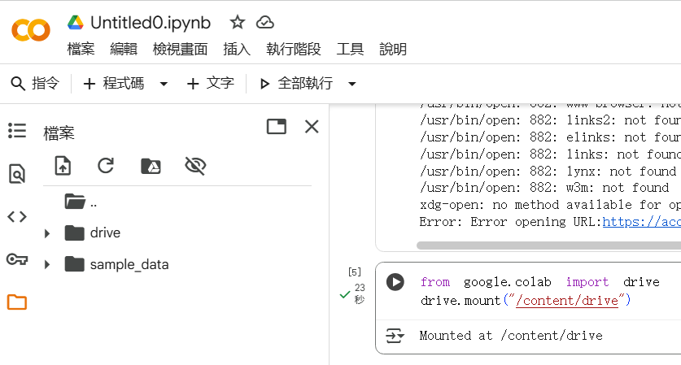

專案內容說明

此 Notebook 主要包含以下部分：

環境測試與初始設定

建立簡單的變數與輸出（a = 1）。

使用 !ls 查看當前 Colab 目錄內容。

嘗試使用 google-drive-ocamlfuse 掛載 Google Drive

嘗試安裝 google-drive-ocamlfuse 並進行 OAuth 驗證。

不過因為 Colab 版本限制及憑證問題，該方法會產生錯誤（invalid_client）。

改用官方方式掛載 Google Drive

最後成功使用 from google.colab import drive 進行掛載：

from google.colab import drive
drive.mount("/content/drive")

掛載成功後，可以透過 /content/drive/MyDrive 路徑存取 Google Drive 檔案。

⚙️ 執行步驟

打開此 Notebook：

執行前兩個測試區塊：

步驟1:

添加代碼塊

我們就可以在代碼框中輸入一些代碼，如果我們直接輸入代碼，系統會當作是Python代碼執行。例如我們輸入：

步驟2:

如果想去執行系統命令，只需要在命令前加感嘆號!。例如我們輸入： 

執行之後輸出框中會顯示當前目錄下的所有文件夾。

其實在Google Colab中連接的雲端的那台虛擬機正是使用的Ubuntu操作系統，我們可以將自己在Google Colab中的一切操作看作是在用命令行控制雲

端的那台Ubuntu虛擬機。你可以用它來直接跑代碼，也可以使用一些系統命令（我們後面要安裝第三方軟件都需要借助一系列的系統命令）。

前期配置

1.修改筆記本環境
   
每新建一個Colab項目，都需要先對筆記本環境進行配置，運行類型選擇是Python2還是Python3，硬件類型選擇CPU、GPU或者TPU。

(其中Python2是2.7版本，Python3是3.6版本）

修改完後點擊保存即可。

2.安裝必要的包和軟件

在代碼段中輸入以下代碼：

運行代碼，運行中會提示輸入驗證碼，點擊程序給出的網址進行驗證即可。

3.掛載Google Drive

其實完成前面的操作我們就可以在Google Colab中敲寫代碼或者輸入一些系統命令了，但是我們現在連接的虛擬機是和Google Drive脫離的，也就是說

我們跑的程序無法使用谷歌雲盤里的文件，這就非常受限制了。所以我們一般需要將谷歌雲盤看作是虛擬機中的一個硬盤掛載，這樣我們就可以使用虛擬

機輕松訪問谷歌雲盤。

掛載Google Drive代碼：

運行掛載Google Drive代碼會出現應認證的鏈接

裝載Google Drive，點擊鏈接獲得應用認證碼

應用認證碼，將應用認證碼覆制輸入到下面的文本框中，點擊回車鍵即可

加載成功之後在左邊的文件中多了一個dirve文件夾

加載成功

若需掛載 Google Drive，使用以下正確方法：

from google.colab import drive
drive.mount("/content/drive")

驗證成功後，即可在 Colab 中看到：

Mounted at /content/drive

可用以下指令確認掛載結果：

!ls /content/drive/MyDrive

🧩 注意事項

不建議在 Colab 使用 google-drive-ocamlfuse，因為 Colab 內建的 Google Drive 掛載方式更穩定且簡單。

若出現 invalid_client 或 OAuth 失敗訊息，表示使用了不相容的驗證流程。

掛載後，請確保路徑 /content/drive/MyDrive/ 為正確目錄。
